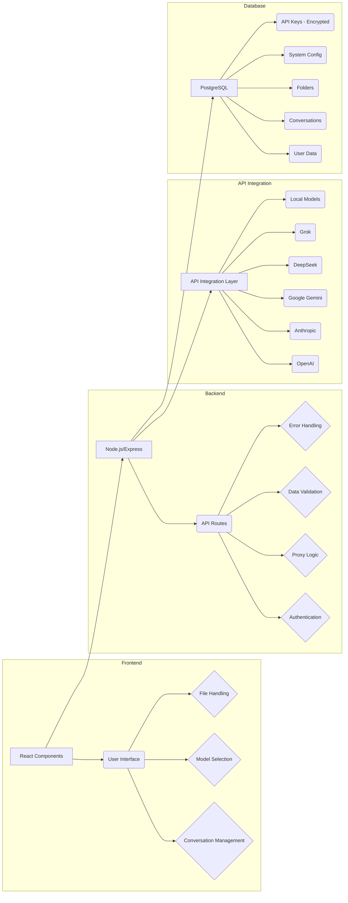

# AIHubMatrix: Your Universal AI Interface

<p align="center">

</p>

<p align="center">
  <em>The ultimate interface for seamless interaction with any AI model</em>
</p>

---

## ✨ LIVE DEMO AVAILABLE! ✨

<div align="center">
  <h3>🚀 <a href="https://www.aihubmatrix.com">https://www.aihubmatrix.com</a> 🚀</h3>
  <p><strong>Try AIHubMatrix right now without installing anything!</strong></p>
</div>

### Demo Features:

| 🤖 | **Available models:** DeepSeek R1, Gemini 2.0 Pro Experimental |
|:--:|:----------------------------------------------------------------|
| 🔑 | Add **your own API keys** to access all supported models |
| ➕ | Add **any custom model** compatible with supported APIs |
| 📝 | *Data availability not guaranteed in this demo version* |

**Just register with your email and start exploring all the features!**

💌 Contact: [cescanuela@gmail.com](mailto:cescanuela@gmail.com)

---


## 📋 Table of Contents

- [Introduction](#introduction)
- [Key Differentiators](#key-differentiators)
- [Key Features](#key-features)
- [Getting Started](#getting-started)
  - [Prerequisites](#prerequisites)
  - [Installation](#installation)
  - [Initial Login](#initial-login)
  - [HTTPS Certificates](#https-certificates-important)
- [Using AIHubMatrix](#using-aihubmatrix)
  - [User Interface Overview](#user-interface-overview)
  - [Managing Conversations](#managing-conversations)
  - [Working with Models](#working-with-models)
  - [File and Image Handling](#file-and-image-handling)
  - [Advanced Features](#advanced-features)
- [API Integration](#api-integration)
  - [Supported Providers](#supported-providers)
  - [API Key Setup](#api-key-setup)
- [For Developers](#for-developers)
  - [Architecture Overview](#architecture-overview)
  - [Frontend Structure](#frontend-structure)
  - [Backend Structure](#backend-structure)
  - [Database Schema](#database-schema)
  - [Contributing](#contributing)
- [Troubleshooting](#troubleshooting)
- [Security Considerations](#security-considerations)
- [Roadmap](#roadmap)
- [Versioning](#versioning)
- [Authors/Maintainers](#authorsmaintainers)
- [Support](#support)
- [License](#license)

---

## Introduction

AIHubMatrix is a powerful, flexible, and user-friendly web application designed to be your single point of interaction with a wide range of AI models from different providers. It's built for researchers, developers, and anyone who wants to experiment with and compare different AI models without the hassle of switching between platforms. AIHubMatrix solves the problem of fragmented AI interaction by providing a central hub, advanced conversation management, and unique features like in-conversation model switching. It allows you to seamlessly switch between models, manage complex conversations, organize your work with folders, and integrate with multiple leading AI providers.

Rather than being locked into a single AI provider or model, AIHubMatrix serves as your central hub for AI interactions, adapting to your specific needs with a clean, intuitive interface. The system comes pre-configured with templates for the most popular models, but you can easily add any model that works with the supported APIs.

## Key Differentiators

What truly sets AIHubMatrix apart from other AI interfaces? Here are the features that make it unique and powerful:

### 🔄 Dynamic, In-Conversation Model Switching

This is a game-changer. Most AI interfaces lock you into a single model for an entire conversation. AIHubMatrix lets you *change models on the fly, mid-conversation*. Ask a question with one model, get a response, then switch to a different model for a different perspective or to leverage its specific strengths. This is invaluable for:

- **Comparative Analysis:** Directly compare how different AIs approach the same prompt.
- **Task Specialization:** Use the best model for each stage of your workflow (e.g., brainstorming with one model, refining with another).
- **Fallback Options:** If one model struggles, instantly switch to another.
- **Cost Optimization:** Use powerful (and potentially more expensive) models only when needed.

### 🎛️ Fine-Grained Conversation Control

AIHubMatrix gives you unprecedented control over your conversation history:

- **Message Exclusion/Inclusion:** Don't just delete messages – *exclude* them from the AI's context. This lets you experiment with different lines of questioning without permanently losing your work. You can toggle messages in and out of the context as needed.
- **Selective Deletion:** Of course, you can also permanently delete messages if you choose.
- **Conversation as a Living Document:** Think of your conversations as dynamic documents, not just static transcripts.

### 👁️ Universal Vision Capabilities

AIHubMatrix makes *every* AI model "vision-capable," even if it doesn't natively support image input:

- **Native Support:** For models like GPT-4o and Claude 3, images are sent directly.
- **Google Vision Integration:** For text-only models, AIHubMatrix automatically uses Google Vision to analyze images and provide detailed text descriptions to the AI. This opens up a world of possibilities.

### 🔌 Resilient Connections & Background Processing

Never lose your work due to a dropped connection. AIHubMatrix:

- **Continues processing** even if your internet connection is interrupted.
- Provides **real-time status updates** during long operations.
- **Automatically delivers** the completed response when you reconnect.
- Includes **intelligent timeouts** to prevent indefinite processing.

### 📁 Folder Organization

Unlike many interfaces that only offer a flat list of conversations, AIHubMatrix lets you organize your work into hierarchical folders, just like you would on your computer.

### 💾 Conversation Cache

Pre-load context and files into a specific conversation, giving you fine-grained control over the AI's "knowledge base" for that interaction.

### 🛠️ Developer-Friendly

- Clean, modular architecture (React frontend, Node.js/Express backend, PostgreSQL database).
- Easy deployment with Docker.
- Built-in debugging tools.

### 🌐 True Multi-Provider Support

AIHubMatrix isn't tied to a single vendor. It's designed to work with a growing list of providers, giving you maximum flexibility.

## Key Features

* **Multiple AI Providers:** OpenAI (including Assistants API), Anthropic (Claude), Google Gemini, DeepSeek, Grok, and local models (Ollama, LM Studio).
* **Persistent Conversations:** Your conversations are automatically saved and organized.
* **Conversation Management:** Create, rename, delete, and organize conversations.
* **Folder Management:** Create, rename, delete, and organize folders. Drag and drop conversations and folders.
* **Message Control:** Exclude/include individual messages from the AI's context.
* **File Uploads:** Upload images, PDFs, DOCX, XLSX, TXT, code files, and more.
* **Image Processing:** Automatic image analysis for text-only models (using Google Vision).
* **PDF Processing:** Choose between native PDF handling, OCR (using Google Vision), or text extraction.
* **Code Highlighting:** Syntax highlighting for code snippets.
* **Markdown Support:** Messages are rendered using Markdown.
* **Streaming Support:** Real-time responses from models that support streaming.
* **Multi-User Support:** User authentication and authorization.
* **Admin Panel:** Manage users and system settings.
* **Debug Tools:** View the raw JSON request being sent to the AI provider.
* **Responsive Design:** Works well on desktop and mobile devices.
* **Dark/Light Mode:** Choose your preferred theme.
* **Customizable System Directives:** Set global instructions for models that support them.
* **Conversation Cache:** Pre-load context and files for specific conversations.
* **Retry Mechanism:** Automatic retries for failed API requests.
* **Timeout Handling:** Prevents indefinite processing.
* **Progress Updates:** Real-time feedback during long-running operations.
* **Request Preview Mode:** See the JSON payload before sending.

## Getting Started

### Prerequisites

* **Docker:** [Install Docker](https://docs.docker.com/get-docker/)
* **Docker Compose:** [Install Docker Compose](https://docs.docker.com/compose/install/)
* **Git:** [Install Git](https://git-scm.com/downloads)

### Installation

1. **Clone the Repository:**

   ```bash
   git clone https://github.com/yourusername/aihubmatrix.git
   cd aihubmatrix/Docker
   ```
   **Replace `yourusername/aihubmatrix.git` with the actual URL of your GitHub repository.**

2. **Create a `.env` file:**

   ```bash
   cp .env.example .env
   ```

3. **Edit the `.env` file:** Fill in the required values:

   * `MYSQL_ROOT_PASSWORD`: A strong password for the PostgreSQL root user.
   * `MYSQL_DATABASE`: The database name (default: `AI`).
   * `MYSQL_USER`: The database user (default: `AI`).
   * `MYSQL_PASSWORD`: A strong password for the database user.
   * `NODE_PORT`: The port Node.js will use (default: `3000`, mapped to 443 and 80).
   * `NODE_ENV`: Set to `development` or `production`.
   * `DB_HOST`: The database host (default: `db`, the Docker service name).
   * `SUPERADMIN_EMAIL`: Your initial administrator email address.
   * `SUPERADMIN_PASSWORD`: A *strong* password for the initial administrator.
   * `JWT_SECRET`: A *very strong, randomly generated secret* for JWT. Generate one:
     ```bash
     openssl rand -base64 32
     ```
     Paste the output into the `.env` file.

4. **Configure AI Models (models-config.json):**

   * Edit `Docker/node/src/config_templates/models-config.json`.
   * **Obtain API Keys:** You *must* obtain API keys from the AI providers you want to use (OpenAI, Anthropic, Google, etc.). See the "API Integration" section below for links to their documentation.
   * **Enable Models:** Set `"enabled": true` for the models you want to use.
   * **Enter API Keys:** Replace the placeholder values for `"apiKey"` and `"Authorization"` (if needed) with your actual API keys. *Never* commit your API keys to version control.
   * **Adjust Endpoints (if necessary):** The `endpoint` should be correct for most models, but double-check the provider's documentation.
   * **Customize Model Parameters:** Adjust `maxTokens`, `temperature`, and other parameters as needed.
   * **Local Models:** For local models (like Ollama), set `requiresApiKey` to `false` and provide the correct `endpoint`.

5. **Build and Run:**

   ```bash
   make all
   ```

   This command builds the Docker images and starts the containers.

6. **Access the Application:**

   Open your web browser and go to `https://localhost`. You will likely see a security warning because of the self-signed certificates. Proceed with caution (see "HTTPS Certificates" below).

### Initial Login

Log in with the `SUPERADMIN_EMAIL` and `SUPERADMIN_PASSWORD` you set in your `.env` file.

### HTTPS Certificates (IMPORTANT)

**The default setup uses self-signed certificates for development. These are NOT secure for production.** You *must* replace them.

**Options:**

1. **Let's Encrypt (Recommended):**
   * Requires a domain name pointing to your server.
   * Use a tool like Certbot (often integrated with Docker Compose). Search for "docker compose letsencrypt" for instructions.

2. **Manual Certificate Installation:**
   * Obtain SSL certificates from a Certificate Authority (CA).
   * Place your `.crt` (certificate) and `.key` (private key) files in the `Docker/cert` directory.
   * Ensure the filenames match your domain name (e.g., `yourdomain.com.crt`, `yourdomain.com.key`).
   * Restart Docker: `make down && make all`

3. **Reverse Proxy:**
   * Use a reverse proxy (Nginx, Traefik, Caddy) *in front of* the AIHubMatrix containers.
   * Configure the reverse proxy to handle SSL termination.

## Using AIHubMatrix

### User Interface Overview

The AIHubMatrix interface provides a clean and intuitive layout:

1. **Sidebar:** On the left side, you'll find:
   * A list of your existing conversations.
   * A "New Conversation" button.
   * A hierarchical view of your conversation folders.
   * A collapsible menu at the bottom for settings and other options.

2. **Chat Area:** The main area displays the currently selected conversation with messages formatted for readability, supporting Markdown, code highlighting, and file previews.

3. **Input Area:** At the bottom of the screen is the input area, where you can:
   * Type your messages.
   * Upload files (drag and drop or use the paperclip icon).
   * Select the AI model you want to use.
   * Access the "Cache" configuration.
   * Toggle the "Debug JSON" option.
   * Send your message with the send button (or Ctrl+Enter/Cmd+Enter).

### Managing Conversations

#### Creating and Organizing Conversations

* **Creating Conversations:** Click the "New Conversation" button in the sidebar.
* **Switching Conversations:** Click on a conversation in the sidebar to load it.
* **Renaming Conversations:** Double-click on a conversation title in the sidebar to edit it.
* **Deleting Conversations:** Right-click (or long-press) on a conversation and select "Delete".

#### Folders

* **Creating Folders:** Right-click on the root folder ("/") or any existing folder and select "New Folder".
* **Moving Conversations:** Drag and drop conversations between folders.
* **Renaming Folders:** Double-click on a folder name to rename it.
* **Deleting Folders:** Right-click on a folder and select "Delete".
* **Expanding/Collapsing Folders:** Click on the arrow icon next to a folder.

#### Conversation Cache

The "Cache" button in the input area opens a dialog where you can:

* Add text notes for context.
* Upload reference files.
* Configure how PDF files are processed (text extraction or OCR).

### Working with Models

#### Model Selection and Switching

* **Selecting a Model:** Use the dropdown menu in the input area to choose the AI model for the *current* conversation.
* **Configuring Models:** Click the "Configure Models" button in the sidebar menu.
* **Switching Models Mid-Conversation:** You can change the model *at any time* during a conversation - the conversation history will be preserved, and the system will automatically format the messages appropriately for the new model.

#### Adding Custom Models

AIHubMatrix comes pre-configured with popular models, but you can add any compatible model:

1. Click "Configure Models" in the menu.
2. Select "Add New Model".
3. Enter the model details:
   * **Basic Information:** Name, group, description.
   * **API Details:** Endpoint URL, authentication method.
   * **Model Parameters:** Context window size, temperature, token limits.
   * **Capabilities:** Vision support, system directive support, cache support.

### File and Image Handling

#### Supported File Types

AIHubMatrix supports a wide variety of file types, including:

* Images: JPG, PNG, GIF, WebP
* Documents: PDF, DOCX, TXT, RTF, XLSX, CSV
* Archives: ZIP, RAR (contents are extracted)
* Code: Various programming language files
* HTML files

#### Uploading Files

* Click the paperclip icon in the input area.
* Drag and drop files directly into the input area.

#### File Processing

* **Images:** For models with native image support, the image is sent directly. For text-only models, Google Vision is used to extract text and labels.
* **PDFs:** You can choose between native PDF processing, OCR using Google Vision, or plain text conversion.
* **Archives (ZIP, RAR):** AIHubMatrix will extract the contents, allowing you to see the file structure and access individual files.
* **Code Files:** Code is displayed with syntax highlighting.
* **HTML Files:** You can choose to view a preview of the rendered HTML or view the source code.

### Advanced Features

* **Message Control:** For each message in a conversation, you can:
  * **View Options:** Toggle between Markdown and plain text views.
  * **Copy Options:** Copy as rich text or plain text.
  * **Inclusion Control:** Check/uncheck "Include in Conversation" to control whether the message is included in the AI's context.
  * **Delete:** Remove the message entirely.
* **System Directives & Cache:** For models that support it, you can configure:
  * **System Directives:** Set global instructions that apply to all conversations with a particular model.
  * **Cache Context:** Provide background information that persists across conversations.
* **Debug Tools:** For developers and power users:
  * **Debug Panel:** View detailed logs of system operations.
  * **Debug JSON:** Inspect the raw JSON request being sent to the AI provider.
  * **Request Preview:** Preview API requests before sending them.

## API Integration

### Supported Providers

#### OpenAI

* **Models:** GPT-4o, O1, O1-mini, and others accessible via the standard Chat Completions API
* **Supports:** OpenAI Assistants API
* **API Documentation:** [https://platform.openai.com/docs/api-reference](https://platform.openai.com/docs/api-reference)
* **Pricing:** [https://openai.com/pricing](https://openai.com/pricing)

#### Anthropic

* **Models:** Claude 3 family (Opus, Sonnet, Haiku), Claude 3.5 Sonnet, Claude 3.7 Sonnet
* **API Documentation:** [https://docs.anthropic.com/claude/reference/getting-started-with-the-api](https://docs.anthropic.com/claude/reference/getting-started-with-the-api)
* **Pricing:** [https://www.anthropic.com/pricing](https://www.anthropic.com/pricing)

#### Google Gemini

* **Models:** Gemini family (e.g., `gemini-1.5-pro-002`, `gemini-1.5-flash-002`)
* **API Documentation:** [https://ai.google.dev/api/rest](https://ai.google.dev/api/rest)
* **Pricing:** [https://ai.google.dev/pricing](https://ai.google.dev/pricing)

#### DeepSeek

* **Models:** DeepSeek Reasoner
* **API Documentation:** [https://platform.deepseek.com/docs](https://platform.deepseek.com/docs)
* **Pricing:** [https://platform.deepseek.com/pricing](https://platform.deepseek.com/pricing)

#### Grok
* **Models:** Grok-2-1212, Grok-2-vision-1212
* **API Documentation:** [https://api.x.ai/docs](https://api.x.ai/docs)
* **Pricing:** [https://x.ai/pricing](https://x.ai/pricing)

#### Local Models

* You can use locally hosted models (e.g., through Ollama or LM Studio) by providing an OpenAI-compatible API endpoint.

### API Key Setup

1. **Obtain API Keys:**
    * **OpenAI:** Create an account at [https://platform.openai.com/](https://platform.openai.com/) and generate an API key.
    * **Anthropic:** Request API access at [https://www.anthropic.com/](https://www.anthropic.com/).
    * **Google Gemini:** Get an API key from the Google AI Studio: [https://ai.google.dev/](https://ai.google.dev/)
    * **DeepSeek:** Obtain API key from [https://platform.deepseek.com/](https://platform.deepseek.com/)
    * **Grok:** Obtain API key from [https://api.x.ai/](https://api.x.ai/)
    * **Local Models:** No API key is required, but you'll need the endpoint URL of your local server.

2. **Configure `models-config.json`:**
    * Open the `Docker/node/src/config_templates/models-config.json` file.
    * For each model you want to use:
        * Set `"enabled": true`.
        * Enter your API key in the `"apiKey"` field.  **Never commit your API keys to version control.**
        * If the model requires an `Authorization` header (like OpenAI), make sure it's in the format `"Authorization": "Bearer YOUR_API_KEY"`.
        * Adjust the `endpoint`, `maxTokens`, `temperature`, and other parameters as needed.  Refer to the model provider's documentation for details.
        * Set `"imageSupport"` to `true` if the model natively supports image input.
        * Set `"pdfProcessing"` to `"native"` if the model natively supports PDF files, `"text"` for plain text extraction, or `"google_vision"` for OCR using Google Vision.

## For Developers

### Architecture Overview

AIHubMatrix is a full-stack web application with the following architecture:

* **Frontend:** React (using functional components and hooks) for a dynamic and responsive user interface.
* **Backend:** Node.js with Express for a lightweight and efficient API server.
* **Database:** PostgreSQL for reliable and scalable data storage.
* **Containerization:** Docker and Docker Compose for easy deployment and consistent environments.



### Frontend Structure

The frontend code is organized into components within `Docker/node/src/protected/ai/js/components/`. Key components include:

* **`ChatBox`**: The main chat interface component, handling message display, input, and interaction.
  * `ChatBox.js`: Main component logic.
  * `conversation-manager.js`: Functions for managing conversations (loading, creating, deleting).
  * `message-formatters.js`: Functions for parsing and formatting message content (Markdown, code, files).
  * `message-handlers.js`: Functions for handling user actions on messages (sending, deleting, toggling inclusion).
  * `ui-components.js`: Smaller UI components used within the ChatBox.
  * `utils.js`: Utility functions for the ChatBox.
* **`ConversationsList/`:** Manages the sidebar, including conversation and folder lists.
  * `ConversationsList.js`: Main component for the sidebar.
  * `Conversations/`: Components for individual conversation items.
  * `Folders/`: Components for folder items and folder management.
  * `ContextMenu.js`: Context menu for conversations and folders.
  * `NewFolderInput.js`: Input field for creating new folders.
* **`InputContainer.js`:** Handles user input (text and files) and model selection.
* **`ModelConfigDialog.js`:** Dialog for configuring AI model settings.
* **`DebugJsonModal.js`:** Displays the raw JSON request for debugging.
* **`DebugJsonToggle.js`:** Toggles the visibility of the DebugJsonModal.
* **`MenuFooter.js`:** The footer of the sidebar, containing options and actions.
* **`NewConversationButton.js`:** Button for creating new conversations.
* **`SystemConfig.js`:** Component for managing system-wide configuration.
* **`ThemeToggle.js`:** Toggle for switching between light and dark themes.
* **`UploadButton.js`:** Handles file uploads.
* **`services/`:**
  * `api-service.js`: Functions for making API requests to the backend.
  * `file-processor.js`: Client-side logic for processing files (image previews, PDF handling, etc.).
  * `model-service.js`: Functions for interacting with the model configuration.
  * `notification.js`: Functions for displaying notifications to the user.
* **`dom-elements.js`:** Functions for interacting with DOM elements.
* **`adjustInputHeight.js`:** Functions for adjusting the height of the input area.
* **`app.js`:** The main application entry point.

### Backend Structure

The backend code is organized as follows:

* **`app.js`:** The main Express application setup, including middleware and route definitions.
* **`server.js`:** Starts the HTTPS and HTTP servers.
* **`routes/`:** Defines the API endpoints:
  * `admin.js`: Admin-only routes (user management, etc.).
  * `auth.js`: Authentication routes (login, register, logout).
  * `conversations.js`: Routes for managing conversations and messages.
  * `folders.js`: Routes for managing folders.
  * `health.js`: Health check endpoint.
  * `models.js`: Routes for managing AI model configurations.
  * `proxy.js`: The core proxy route that forwards requests to the appropriate AI provider.
  * `systemConfig.js`: Routes for managing system-wide configuration.
  * `vision.js`: Routes for Google Vision API integration.
* **`controllers/`:** Handles the logic for each API endpoint. This is where most of the backend logic resides.
  * `proxyController/`: Contains the core logic for handling requests to different AI providers, including:
    * `handlers/`: Functions for handling client disconnections and timeouts.
    * `services/`: Services for interacting with specific AI providers (OpenAI, Anthropic, etc.).
    * `utils/`: Utility functions for error handling, message transformation, etc.
  * `adminController.js`: Controller for admin-related actions.
  * `authController.js`: Controller for authentication.
  * `conversationsController.js`: Controller for managing conversations.
  * `folderController.js`: Controller for managing folders.
  * `healthController.js`: Controller for health checks.
  * `modelsController.js`: Controller for managing model configurations.
  * `systemConfigController.js`: Controller for managing system configuration.
  * `visionController.js`: Controller for Google Vision API integration.
* **`services/`:**
  * `db-service.js`: Provides an abstraction layer for interacting with the PostgreSQL database. This module uses the `pg` library.
    * `connect-setup-service.js`: Handles database connection and setup.
    * `conversation-service.js`: Functions for managing conversations in the database.
    * `folder-service.js`: Functions for managing folders in the database.
    * `model-service.js`: Functions for managing model configurations in the database.
    * `system-service.js`: Functions for managing system configuration in the database.
    * `token-service.js`: Functions for managing user tokens.
    * `user-service.js`: Functions for managing user accounts.
    * `vision-service.js`: Functions for managing Google Vision configuration.
  * `model-service.js`: Handles loading and saving model configurations.
* **`middlewares/`:**
  * `authMiddleware.js`: Middleware for authentication and authorization.
  * `errorHandler.js`: Global error handling middleware.
  * `logger.js`: Request logging middleware.
* **`config/`:**
  * `db-config.js`: Database connection configuration.
  * `vision-config.js`: Google Vision API configuration.
* **`config_templates/`:**
  * `models-config.json`: Template for AI model configurations.

### Database Schema

The database schema is defined in `Docker/postgres/init/init.sql`. Key tables include:

* **`users`:** Stores user information (email, password hash, admin status, active status, conversation order, folder order, active conversation ID).
* **`conversations`:** Stores conversation data (messages, model ID, title, folder ID, user ID, timestamps).
* **`folders`:** Stores folder information (name, parent folder ID, user ID).
* **`system_config`:** Stores system-wide configuration (system directives, cache context).
* **`conversation_cache`:** Stores cached context information for conversations (text and files).
* **`tokens`:** Stores user authentication tokens (JWTs).
* **`vision_config`:** Stores Google Vision API configuration.
* **`models_config`:** Stores AI model configurations.

### Contributing

1. **Fork** the repository.
2. **Create a branch:** `git checkout -b feature/your-feature-name`
3. **Make changes** and commit them: `git commit -m "Add some feature"`
4. **Push** to the branch: `git push origin feature/your-feature-name`
5. Create a **Pull Request**.

Please follow the existing code style and include tests for any new functionality.

## Troubleshooting
* **I can't connect to the application:**
  * Make sure Docker and Docker Compose are running.
  * Check that the containers are running: `docker ps`
  * Verify that the ports are not blocked by a firewall.
  * Check the logs for errors: `make logs`
* **I'm getting an error when I try to use a specific AI model:**
  * Make sure you have a valid API key for that model.
  * Check that the API key is correctly configured in `models-config.json`.
  * Verify that the model ID and endpoint are correct.
  * Check the model provider's documentation for any specific requirements.
* **I'm having trouble with file uploads:**
  * Make sure the file type is supported.
  * Check the file size limits.
  * If you're using Google Vision, ensure your API key is correctly configured.
* **My conversations are not saving:**
  * Verify that the database is running and accessible.
  * Check the browser's developer console for any errors.
  * Ensure that you are logged in.

## Security Considerations

* **API Keys:** *Never* commit API keys to version control. Store them securely in the `.env` file.
* **HTTPS:** Use valid SSL certificates for production deployments.
* **User Authentication:** AIHubMatrix uses JWT for authentication. Ensure that the `JWT_SECRET` is a strong, randomly generated secret.
* **Input Validation:** The backend validates user input to prevent common vulnerabilities.
* **Rate Limiting:** Consider implementing rate limiting to prevent abuse.
* **Regular Updates:** Keep the application and its dependencies up to date to patch security vulnerabilities.

## Roadmap

* [ ] Improved error handling and user feedback.
* [ ] Support for more AI providers and models.
* [ ] Enhanced conversation management features.
* [ ] User interface improvements.
* [ ] More robust testing.
* [ ] Advanced analytics and usage tracking.
* [ ] Collaborative features for team environments.
* [ ] Enhanced security features including SSO options.


## Authors/Maintainers
* Carlos Escañuela García - Lead Developer and Project Maintainer

## Support
If you encounter any issues or have questions about AIHubMatrix, please:

1. Check the [Troubleshooting](#troubleshooting) section
2. Search for existing issues in the GitHub repository
3. Contact the administrator at support@aihubmatrix.com

For enterprise support options, please visit our website.

## License

This project is licensed under the MIT License - see the `LICENSE` file for details.

---

<p align="center">
  
  <br>
  <em>The ultimate interface for AI interaction</em>
</p>